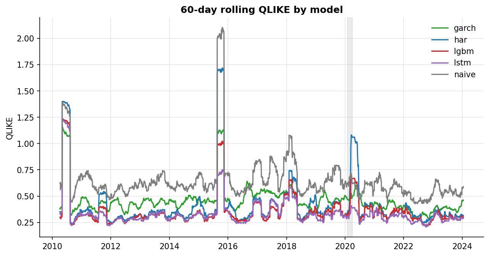
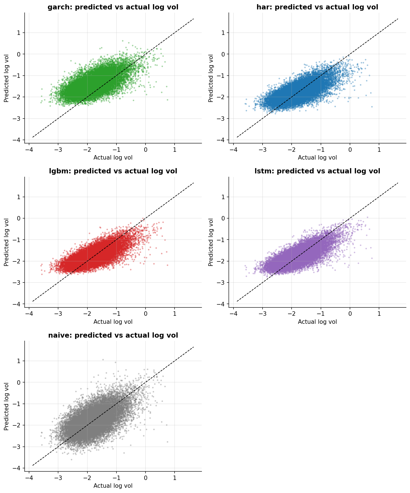
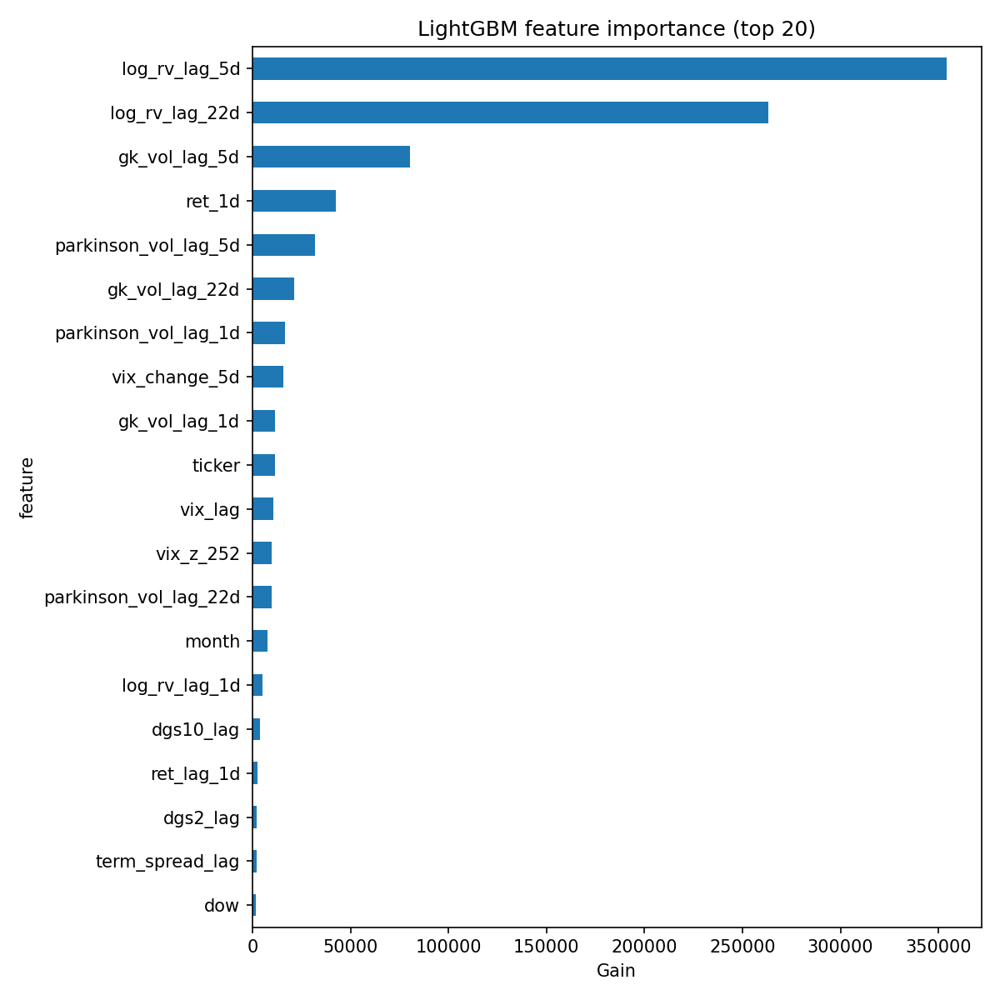
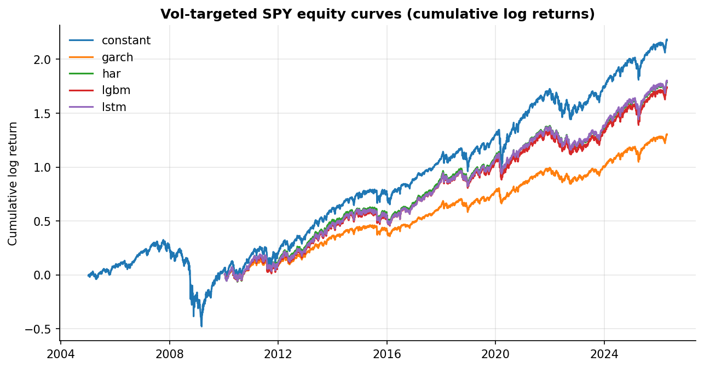

# rvforecast

Walk-forward realized-volatility forecasting for US equities. The target is one-day-ahead log realized volatility on a static S&P 500 universe. Five models: naive, HAR-RV (Heterogeneous Autoregressive Realized Volatility), GARCH(1,1) (Generalized Autoregressive Conditional Heteroskedasticity), LightGBM (gradient-boosted decision trees), and a 5-seed LSTM (Long Short-Term Memory recurrent network) ensemble. Evaluation: QLIKE, out-of-sample R² versus HAR, and pairwise Diebold–Mariano tests, with the last two years held out for a one-shot final test.

If you're a quant or ML reviewer skimming this, the things to check are: leakage tests pass, walk-forward is purged and embargoed, the holdout is only touched once, the baselines aren't strawmen, and QLIKE (not MSE) is the loss for variance forecasts. The glossary below covers every abbreviation and metric used in the rest of the document.

## Glossary

Skip if you already know them. Otherwise this is the one place every term gets defined.

**The thing being predicted**

- **Realized volatility (RV)**: how much prices actually moved, measured ex-post from price data. RV is real and observable. Distinct from *implied* volatility, which is a forward-looking expectation derived from option prices (defined under Data sources, below).
- **Garman–Klass (GK) estimator**: the daily RV measurement we use, computed from a single day's open/high/low/close: `RV² = 0.5·ln(H/L)² − (2·ln 2 − 1)·ln(C/O)²`. Lower estimation noise than close-to-close standard deviation under typical equity dynamics. Reference: Garman & Klass (1980).
- **Log target**: the model predicts `log(RV)` rather than `RV` itself, because RV is right-skewed and log space is closer to Gaussian. Predictions are exponentiated before being scored with QLIKE.
- **One-day-ahead**: at the close of trading day `t−1`, the model uses everything known up to that close to predict day `t`'s realized vol.

**Models**

- **Naive**: predict tomorrow's vol equals today's vol. The floor every other model has to beat.
- **HAR-RV** (Corsi 2009): pooled linear regression of next-day log realized vol on its 1-day, 5-day, and 22-day rolling-mean lags, with one fixed-effect dummy per ticker (so different tickers can have different baseline vol levels). The literature's standard hard-to-beat baseline.
- **GARCH(1,1)** (Bollerslev 1986): econometric model of conditional variance using one lag of past squared returns and one lag of past variance. Refit monthly per ticker.
- **LightGBM**: gradient-boosted decision-tree library (Microsoft, open-source). Tuned once with Optuna on a fixed pre-walk-forward window, then frozen.
- **LSTM** (Hochreiter & Schmidhuber 1997): recurrent neural network. Five seeds per fold; we report the per-row mean as the prediction and the per-row standard deviation across seeds as `y_pred_std`.

**Metrics**

Abbreviations are defined first so the metrics that use them are unambiguous.

- **OOS (out-of-sample)**: evaluated on data not used to fit the model. Walk-forward folds and the holdout are both OOS by construction.
- **MSE (mean squared error)**: `mean[(true − pred)²]`. Symmetric in raw error; *not* appropriate as a headline for variance forecasts because it penalizes proportional over- and under-prediction asymmetrically (see QLIKE).
- **SSE (sum of squared errors)**: `sum[(true − pred)²]`. Used inside `r²_oos` below.
- **OLS (ordinary least squares)**: the standard linear-regression estimator. Used in HAR-RV.
- **SHAP (SHapley Additive exPlanations)**: a feature-attribution method for tree models. Reports how much each feature pushed each prediction up or down, so we can see *why* LightGBM is making the predictions it makes.

The metrics themselves:

- **mse_log**: `mean[(log(RV_true) − log(RV_pred))²]`. The training-time loss; reported alongside QLIKE because it's what the models actually optimize.
- **QLIKE** (Patton 2011): the right loss for variance forecasts. For variances σ²_true and σ²_pred:
  `QLIKE = σ²_true / σ²_pred − log(σ²_true / σ²_pred) − 1`.
  Lower is better; `QLIKE = 0` only when prediction is exact. Robust to noise in the realized-vol proxy in a way MSE is not. The conversion from log-vol prediction to variance is `σ² = exp(2 · log_vol)`.
- **r²_oos vs HAR** (OOS R-squared with HAR-RV as the baseline): `1 − SSE_model / SSE_HAR`, both SSE on the same OOS sample in log space. Sign convention:
  - `r²_oos > 0` ⇒ beats HAR
  - `r²_oos = 0` ⇒ ties HAR
  - `r²_oos < 0` ⇒ worse than HAR

  Anchoring on HAR rather than the unconditional mean is the convention in this literature because HAR is the benchmark that's actually hard to beat.
- **DM test (Diebold–Mariano)**: pairwise test of whether two forecasts have equal expected loss. We use squared-error loss differentials, a Bartlett HAC variance (Heteroskedasticity-and-Autocorrelation-Consistent: a variance estimator that doesn't break under autocorrelated forecast errors), and the Harvey–Leybourne–Newbold small-sample correction.

**Validation**

- **Walk-forward**: train on the past, test on the future, no random shuffling. The training window expands (or rolls) over time; each fold's test set is contiguous and immediately follows its training window.
- **Purge gap**: a few business days dropped from the *end* of each training window before its matching test window begins. Stops boundary-day features (which depend on rolling stats) from leaking into nearby test-day targets.
- **Embargo**: a few business days excluded *after* each test window, before the next fold's training resumes. Stops rolling features in fold `k+1` from reaching back into fold `k`'s test window. Both purge and embargo follow López de Prado (2018), ch. 7.
- **Holdout**: the last two years of the sample (`HOLDOUT_YEARS=2` in `config.py`), walled off from walk-forward entirely. Predicted exactly once at the very end of the project, so the holdout numbers can't be retro-tuned to.

**Data sources**

- **OHLCV**: Open, High, Low, Close, Volume. Daily bars per ticker, fetched from Yahoo Finance via the `yfinance` library.
- **VIX**: the CBOE (Chicago Board Options Exchange) Volatility Index, a forward-looking 30-day implied volatility on the S&P 500. Fetched daily under the symbol `^VIX`.
- **FRED**: the Federal Reserve Bank of St. Louis Economic Data API. We pull the 10-year (`DGS10`) and 2-year (`DGS2`) Treasury yields and compute their difference (the term spread).
- **SPY**: the SPDR S&P 500 ETF (Exchange-Traded Fund). Underlying asset for the vol-targeting extension.
- **NBER recessions**: official US recession dates from the National Bureau of Economic Research. Used as grey shading in time-series plots.

**Trading-extension terms**

- **Sharpe ratio**: `Sharpe = annualized_mean_return / annualized_vol`. From daily returns: mean is annualized with `× 252`, std with `× √252`. Higher is better; 1.0 is loosely "good," anything above 2 should be looked at suspiciously.
- **Max drawdown (MDD)**: `MDD = min_t (P_t / max_{s ≤ t} P_s − 1)` where `P_t` is the equity curve. `MDD ≤ 0` always; closer to 0 is better. `MDD = −50%` ⇒ the curve once dropped to half its prior peak.
- **Turnover**: sum of `|position_t − position_{t−1}|` across the sample. A turnover of 100 means the position changed by 100 units of leverage cumulatively. Drives transaction costs.
- **Basis point (bp)**: one one-hundredth of one percent (`1bp = 0.0001`). "Net of 5bp per-turn transaction costs" subtracts `0.0005 × |Δposition|` from each day's return before computing the net Sharpe.

## Install

```bash
make install
# equivalent to
python -m pip install -e ".[lstm,shap,dev]"
```

`make install` pulls in `torch` (CPU build) for the LSTM step. For CUDA, install `torch` from the PyTorch CUDA index *before* `make install` so the editable install picks up the GPU build.

## Reproduce

```bash
make data        # fetches OHLCV + VIX + FRED yields
make features    # builds the feature matrix; leakage tests run as part of make test
make baselines   # naive, HAR-RV, GARCH(1,1)
make lgbm        # LightGBM, hyperparameters tuned once on 2005-01-01..2009-12-31
make lstm        # 5-seed LSTM ensemble (requires torch, included by make install)
make eval        # writes metrics.csv and dm_pvalues.csv into results/tables/
make extension   # vol-targeted SPY position sizing
make holdout     # one-shot final-test evaluation on the last two years
```

`make all` runs the whole pipeline. `make test` runs the test suite (~60 tests, no network required); `make lint` runs `ruff` and `black --check`.

## Results

50-name S&P 500 universe, 2005-01-01 → 2026-04-01, walk-forward folds with the last two years held out for a single one-shot evaluation. Lower QLIKE is better. All column headers are defined in the glossary above.

**Walk-forward (162k observations across all folds)**

| model  | qlike | mse_log | r²_oos vs HAR |
|--------|------:|--------:|--------------:|
| lstm   | 0.335 |   0.125 |        +13.5% |
| lgbm   | 0.356 |   0.133 |         +7.7% |
| har    | 0.409 |   0.144 |         (ref) |
| garch  | 0.459 |   0.312 |       −116.1% |
| naive  | 0.647 |   0.225 |        −56.0% |

**One-shot holdout (2024–2026, 25k observations, touched once)**

| model  | qlike | mse_log | r²_oos vs HAR |
|--------|------:|--------:|--------------:|
| lstm   | 0.350 |   0.129 |        +12.5% |
| lgbm   | 0.360 |   0.138 |         +6.6% |
| har    | 0.407 |   0.147 |         (ref) |
| garch  | 0.425 |   0.289 |        −96.1% |
| naive  | 0.638 |   0.231 |        −56.8% |

The walk-forward and holdout rankings agree, the gaps are similar, and the holdout numbers are the slightly worse of the two, which is what you want to see (no holdout overfit). Every pairwise Diebold–Mariano p-value is < 0.001, so the differences are statistically real, with the usual caveat that 10 pairwise tests deserve a multiple-testing correction (a Model Confidence Set is on the roadmap; see "What didn't work" below).



60-day rolling QLIKE per model. Grey bands are NBER recessions. The ML models hold their advantage over HAR through 2008 and 2020 (the periods where forecasts matter most) and never blow up. GARCH consistently lags because the conditional-variance recursion can't keep up with the regime shifts inside a six-month test fold.

### Per-model commentary

- **naive** (predict yesterday's vol). Worst by every metric and the floor every other model has to clear. Useful as a sanity check.
- **GARCH(1,1)**. Beats naive but not HAR. Refit monthly per ticker; the smooth conditional-vol recursion is exactly what you'd want for *position sizing* (lowest turnover in the vol-targeting table below) but not for *point forecasting* on a daily horizon.
- **HAR-RV** (Corsi 2009). The right baseline for this problem. Pooled OLS with ticker fixed effects (per-ticker dummies that absorb level differences across tickers); tied for second by mse_log, third by QLIKE.
- **LightGBM**. +7.7% OOS R² over HAR walk-forward, +6.6% holdout. SHAP and gain-based feature importance both put the 22-day GK lag and the lagged log RV at the top: the model is mostly rediscovering HAR-style aggregations and adding a small nonlinear premium on top.
- **LSTM** (5-seed ensemble; per-row standard deviation across seeds is reported as `y_pred_std`). +13.5% OOS R² over HAR walk-forward, +12.5% holdout. The seed std is non-trivial: single-seed numbers on a panel this small aren't credible, hence the 5-seed protocol.



The diagonal is perfect prediction. Naive scatters along it (it just lags one day behind); GARCH compresses toward the mean (the recursion smooths through volatility spikes); HAR / LightGBM / LSTM track the diagonal more faithfully into the right tail, which is where forecast value lives.



LightGBM's top features by gain. The 22-day GK lag and 22-day log-RV lag dominate. The model is not finding alpha in obscure macro features; it is finding it in the same realized-vol aggregations HAR uses, and learning a mild nonlinearity on top. That's a real finding and goes in "What didn't work" territory: we did *not* find that calendar effects, term-spread, or VIX changes added meaningful predictive content beyond the realized-vol features themselves.

### Vol-targeted SPY (the trading-relevance extension)

Each rule sizes a long SPY position to a 15% annualized vol target using the model's forecast for SPY: `position_t = clip(0.15 / forecast_vol_t, 0, 2)`. The clip-to-2 caps leverage at 2× notional. `sharpe_net_5bp` is the Sharpe ratio after subtracting 5bp of transaction costs per unit of turnover.

| strategy | ann_return | ann_vol | sharpe | max_dd | turnover | sharpe_net_5bp |
|----------|----------:|---------:|-------:|-------:|---------:|---------------:|
| constant (1× SPY) | 10.3% | 19.0% | 0.54 | −80% | 0.0 | 0.54 |
| garch    | 8.0%  |  9.4%  | 0.85 | −15% |  35.4 | 0.84 |
| har      | 11.0% | 13.2%  | 0.83 | −23% |  88.0 | 0.81 |
| lgbm     | 10.7% | 12.8%  | 0.83 | −22% | 116.7 | 0.81 |
| lstm     | 11.1% | 12.8%  | 0.87 | −21% | 134.7 | 0.84 |



Two things worth saying out loud here. First, *every* vol-targeted variant beats constant SPY on Sharpe and on max drawdown. The vol forecast doesn't have to be great for vol targeting to add value, it just has to be reasonable. Second, GARCH gives the **best gross-Sharpe-per-unit-turnover** despite being the worst point forecaster: its forecasts are smoother, so positions don't churn. By contrast LSTM has the highest gross Sharpe but loses the most to costs because it reacts the most. There is no single "best" model for vol-targeting; the answer depends on your transaction-cost regime.

## Repository layout

```
src/rvforecast/
  config.py               constants, paths, seeds, target definitions
  data/                   yfinance + FRED ingestion with manifest cache
  features/               OHLC → realized vol → HAR/range/macro/calendar/sector features
  validation/             purged + embargoed walk-forward splitter
  models/                 naive, har, garch, lgbm, lstm
  evaluation/             metrics (QLIKE, OOS R², DM), plots, holdout, run_eval
  extension/              vol-targeted SPY sizing across forecasts

tests/                    look-ahead, splitter, GARCH-arch contract, DM symmetry, ...
configs/                  ticker universe + sector map
```

## How the usual mistakes are avoided

- **Look-ahead.** Every feature at row `t` is a function of data strictly before `t`. Two tests in `tests/test_features.py` check this: a future spike injected at row `t` doesn't move any feature at earlier rows, and perturbing the OHLC of day `t` itself doesn't move any feature at row `t`.
- **Walk-forward.** Expanding (or rolling) training window, a purge gap between train and test, a local embargo between consecutive folds, and the last two years reserved as a one-shot test. See `src/rvforecast/validation/walk_forward.py`. The exact reasoning for purge and embargo is in the glossary above.
- **Holdout.** `make holdout` retrains each model once on the pre-holdout sample and predicts the held-out two years. The whole point is that you only run it once.
- **Targets and loss.** Target is log Garman–Klass realized vol. Evaluation is QLIKE on variances; training uses MSE in log space because that's what the models actually optimize. Pairwise Diebold–Mariano uses a HAC variance and the Harvey–Leybourne–Newbold small-sample correction.

## What this doesn't fix

- **LightGBM hyperparameters.** Tuned once on `2005-01-01 … 2009-12-31` (strictly before the first walk-forward test fold) and then frozen. Cheaper than nested rolling tuning but obviously less adaptive; see `src/rvforecast/models/lgbm.py`.
- **The vol target itself.** Daily one-day Garman–Klass is a noisy proxy for true realized vol. Intraday data would help.
- **Transaction costs.** The vol-targeting extension subtracts costs additively from log returns (fine at 1–5 bp), rather than modeling them multiplicatively on positions.

## What didn't work

- **Macro features beyond realized vol.** VIX changes, the 252-day VIX z-score, the term spread, and term-spread changes are all in the feature matrix. None of them shows up near the top of LightGBM's gain-based importance; the realized-vol lags dominate. This is a real finding, not a tuning failure: at the daily horizon, the lagged realized-vol signal is so dominant that macro adds little marginal predictive content.
- **Calendar effects.** Day-of-week and month-of-year dummies were included; both rank near the bottom of feature importance.
- **GARCH for point forecasting.** GARCH(1,1) has the lowest QLIKE among the non-naive models. The conditional-variance recursion is too smooth to track the kind of day-by-day dispersion that a daily realized-vol target rewards. (It's still useful for *position sizing*, where smoothness is a feature; see the vol-targeting table above.)
- **Pairwise DM without multiple-testing correction.** Every p-value is essentially zero, so the qualitative ranking holds, but reporting 10 pairwise tests with no Bonferroni / Holm / Romano-Wolf correction is the kind of thing a careful reviewer asks about. Bonferroni and Holm are simple p-value adjustments that scale the threshold by the number of tests; Romano-Wolf is a bootstrap-based stepwise method. The Model Confidence Set (MCS, Hansen-Lunde-Nason 2011) is the right replacement and is on the roadmap.

## References

- Corsi (2009): HAR-RV
- Patton (2011): QLIKE and proper losses for variance forecasts
- López de Prado (2018), *Advances in Financial Machine Learning*, ch. 7: purged + embargoed walk-forward CV
- Bollerslev (1986): GARCH
- Garman & Klass (1980): range-based vol estimators
- Diebold & Mariano (1995); Harvey, Leybourne & Newbold (1997): forecast accuracy testing
- Hochreiter & Schmidhuber (1997): LSTM
- Hansen, Lunde & Nason (2011): Model Confidence Set
